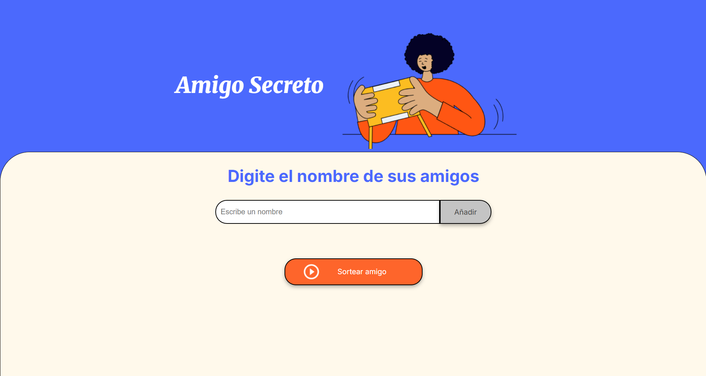
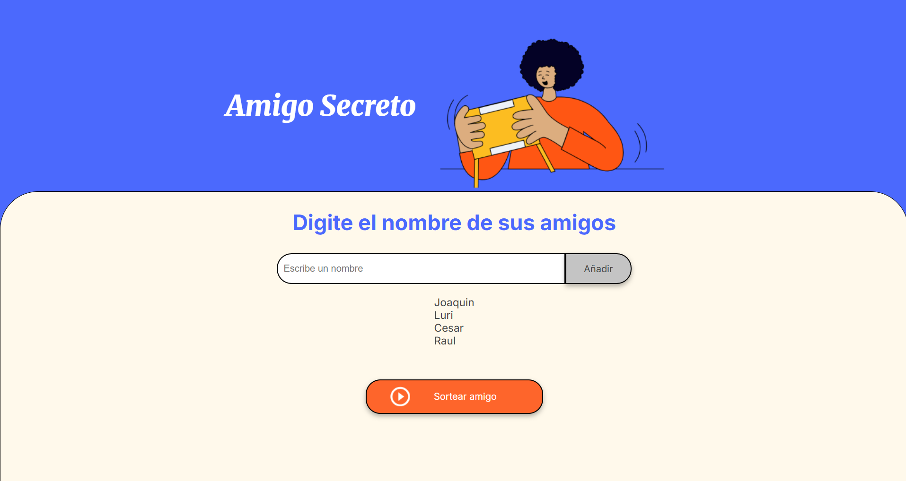
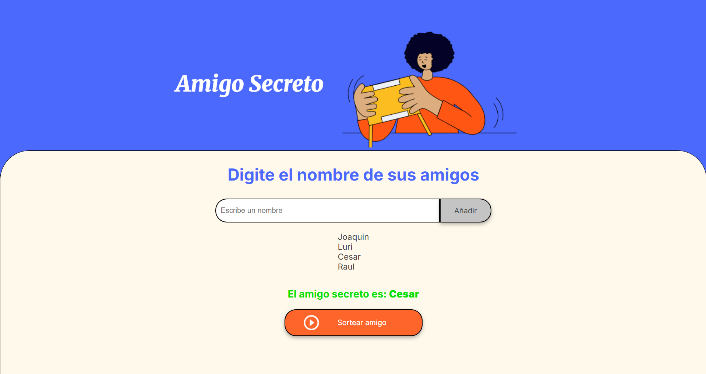

# Challenge Amigo Secreto


Proyecto para sortear amigos y elegir quién será el amigo secreto. El objetivo es afianzar los fundamentos de programación en JavaScript.

## 🚀 Instalando y ejecutando el proyecto de forma local

Para realizar la instalación y ejecución del proyecto se tienen que seguir los siguientes pasos:

1. Clonar el código mediante la consola de git en la carpeta donde desees tener el proyecto:

```sh
git clone https://github.com/Omar05129/challenge-amigo-secreto.git
```

2. Luego, abrir el proyecto en un editor de codigo tal como Visual Studio Code

```sh
code .
```

3. Abrir el archivo index.html para visualizar el proyecto e interactuar

4. Puedes modificar los archivos app.js, index.html o style.css en Visual Studio Code para personalizar la aplicación

## 📌 Descripción del Proyecto
  
El usuario puede interactuar con la página de la siguiente manera:

1. ✍️ Digitar el nombre de sus amigos en el campo de texto.  
2. ➕ Con el botón **"Añadir"**, los nombres ingresados se mostrarán en pantalla en una lista.  
3. 🎉 Finalmente, con el botón **"Sortear amigo"**, se seleccionará aleatoriamente uno de los nombres y este será el **amigo secreto**.  

## ⚙️ Ejecutando las pruebas

La pantalla inicial se ve de la siguiente forma en el navegador

Despues de agregar los nombres, estos se almacenan y se muestran en pantalla

Finalmente, se selecciona el boton "Sortear amigo" y se muestra el amigo secreto


## 🤝 Agradecimientos

Agradecer al equipo de Alura Latam por darme los fundamentos para realizar este proyecto
